# ONEX — Entity Relationship Diagram

> Stress Detection Platform — Database Schema Reference
>
> .NET 10 • Clean Architecture • EF Core • PostgreSQL

---

## Full ERD

```mermaid
erDiagram

    %%===========================================
    %%  USERS & IDENTITY
    %%===========================================

    User ||--o| UserProfile : "1:1  staff profile"
    User ||--o{ UserSession : "1:N  login sessions"
    User ||--o{ UserRole : "1:N  role assignments"
    User ||--o{ AccountContact : "1:N  org memberships"
    User ||--o{ Notification : "1:N  notifications"
    User ||--o| UserNotificationPreferences : "1:1  prefs"
    User ||--o{ UserNotificationTypeSetting : "1:N  type prefs"
    User ||--o{ UserPushToken : "1:N  devices"

    %%===========================================
    %%  RBAC (Role-Based Access Control)
    %%===========================================

    Role ||--o{ UserRole : "1:N  users in role"
    Role ||--o{ RolePermission : "1:N  permissions"
    Role ||--o| DataMaskingPolicy : "1:1  masking config"
    Permission ||--o{ RolePermission : "1:N  role assignments"

    %%===========================================
    %%  ORGANIZATIONS
    %%===========================================

    Account ||--o{ AccountContact : "1:N  employees"
    Account ||--o| AccountSettings : "1:1  config"
    Account ||--o{ Subscription : "1:N  subscriptions"

    %%===========================================
    %%  SUBSCRIPTIONS & BILLING
    %%===========================================

    Plan ||--o{ Subscription : "1:N  subscribers"
    Subscription ||--o{ Invoice : "1:N  invoices"

    %%===========================================
    %%  NOTIFICATIONS
    %%===========================================

    NotificationType ||--o{ Notification : "1:N  instances"
    NotificationType ||--o{ UserNotificationTypeSetting : "1:N  user prefs"
    Notification ||--o{ NotificationDelivery : "1:N  delivery tracking"

    %%===========================================
    %%  ENTITY COLUMNS
    %%===========================================

    User {
        guid      Id               PK
        string    Email            UK "Login email"
        string    FirstName
        string    LastName
        string    PasswordHash        "BCrypt"
        enum      AccountType         "Staff | EndUser"
        enum      Status              "Active | Inactive | Suspended"
        datetime  CreatedAt
        datetime  LastLoginAt
        datetime  DeactivatedAt
    }

    UserProfile {
        guid      Id               PK
        guid      UserId           FK "-> User"
        enum      Department          "Development | DataScience | Operations | Management"
        string    DisplayJobTitle
        string    InternalJobTitle
        decimal   HourlyCost          "Sensitive — admin only"
        string    PhoneNumber
        datetime  HireDate
        string    AvatarUrl
    }

    UserSession {
        guid      Id               PK
        guid      UserId           FK "-> User"
        string    TokenHash
        string    RefreshTokenHash
        datetime  CreatedAt
        datetime  ExpiresAt
        datetime  LastActivityAt
        string    IpAddress
        string    UserAgent
        string    DeviceId
        bool      IsValid
    }

    UserRole {
        guid      Id               PK
        guid      UserId           FK "-> User"
        guid      RoleId           FK "-> Role"
        datetime  AssignedAt
        guid      AssignedBy
    }

    Role {
        guid      Id               PK
        string    Name             UK
        string    Description
        bool      IsSystemRole
        bool      CanViewSensitiveData
        bool      IsActive
        datetime  CreatedAt
        datetime  UpdatedAt
    }

    Permission {
        guid      Id               PK
        enum      Module              "Users | Roles | Accounts | StressData | ..."
        enum      Action              "Create | Read | Update | Delete"
        string    Code             UK "e.g. USERS:CREATE"
        string    Name
        string    Description
    }

    RolePermission {
        guid      Id               PK
        guid      RoleId           FK "-> Role"
        guid      PermissionId     FK "-> Permission"
        datetime  AssignedAt
    }

    DataMaskingPolicy {
        guid      Id               PK
        guid      RoleId           FK "-> Role"
        flags     VisibleFields       "Phone | Email | Revenue | ..."
        string    PhoneMask
        string    EmailMaskValue
        string    FinancialMaskValue
    }

    Account {
        guid      Id               PK
        string    Name                "Organization name"
        string    Industry
        string    Website
        string    Phone
        string    Address
        string    TaxNumber
        string    InternalNotes       "Staff-only notes"
        bool      IsActive
        datetime  CreatedAt
        datetime  UpdatedAt
    }

    AccountContact {
        guid      Id               PK
        guid      AccountId        FK "-> Account"
        guid      UserId           FK "-> User"
        bool      IsPrimaryContact
        string    Role                "Job title at org"
        bool      IsDecisionMaker
        bool      IsInviteAccepted
        bool      IsActive
        datetime  CreatedAt
    }

    AccountSettings {
        guid      Id               PK
        guid      AccountId        FK "-> Account (unique)"
        int       MaxEmployees
        int       MaxMonitoredUsers
        long      MaxStorageMb
        bool      DashboardAccessEnabled
        bool      AllowEmployeeSelfInvite
        bool      RequireInviteApproval
        int       InviteExpirationDays
    }

    Plan {
        guid      Id               PK
        string    Name             UK
        string    Description
        decimal   MonthlyPrice
        decimal   YearlyPrice
        string    CurrencyCode        "ISO 4217"
        int       MaxUsers
        int       DataRetentionDays
        bool      HasRealtimeAlerts
        bool      HasWeeklyReports
        bool      HasExport
        int       SortOrder
        bool      IsActive
        datetime  CreatedAt
    }

    Subscription {
        guid      Id               PK
        guid      AccountId        FK "-> Account"
        guid      PlanId           FK "-> Plan"
        enum      BillingCycle        "Monthly | Yearly"
        enum      Status              "Active | PastDue | Cancelled | Expired"
        datetime  StartDate
        datetime  CurrentPeriodEnd
        datetime  CancelledAt
        datetime  CreatedAt
    }

    Invoice {
        guid      Id               PK
        guid      SubscriptionId   FK "-> Subscription"
        guid      AccountId        FK "-> Account"
        string    InvoiceNumber    UK "INV-2025-0001"
        decimal   Amount
        string    CurrencyCode
        enum      Status              "Draft | Issued | Paid | Overdue | Cancelled"
        string    Description
        datetime  PeriodStart
        datetime  PeriodEnd
        datetime  IssuedAt
        datetime  DueDate
        datetime  PaidAt
    }

    NotificationType {
        guid      Id               PK
        string    Code             UK "e.g. stress.high_detected"
        string    Name
        string    Description
        enum      Category            "System | StressAnalysis | Billing | Security | General"
        enum      DefaultPriority
        flags     DefaultChannels     "InApp | Email | Push | SMS"
        string    IconName
        string    ColorHex
        bool      IsActive
        bool      IsSystemType
        string    TemplateTitle
        string    TemplateBody
        datetime  CreatedAt
    }

    Notification {
        guid      Id               PK
        guid      UserId           FK "-> User"
        guid      TypeId           FK "-> NotificationType"
        string    Title
        string    Message
        enum      Priority
        string    EntityType
        guid      EntityId
        string    ActionUrl
        string    ActionText
        string    Metadata            "JSON"
        string    GroupKey
        bool      IsRead
        datetime  ReadAt
        datetime  CreatedAt
    }

    NotificationDelivery {
        guid      Id               PK
        guid      NotificationId   FK "-> Notification"
        enum      Channel
        enum      Status              "Pending | Sent | Delivered | Failed"
        datetime  SentAt
        datetime  DeliveredAt
        datetime  ClickedAt
        string    FailureReason
        int       RetryCount
        datetime  NextRetryAt
        string    ExternalId          "FCM / APNs ID"
    }

    UserNotificationPreferences {
        guid      Id               PK
        guid      UserId           FK "-> User"
        bool      InAppEnabled
        bool      EmailEnabled
        bool      PushEnabled
        bool      SmsEnabled
        bool      EmailDigestEnabled
        enum      EmailDigestFrequency  "Daily | Weekly"
        time      EmailDigestTime
        bool      QuietHoursEnabled
        time      QuietHoursStart
        time      QuietHoursEnd
    }

    UserNotificationTypeSetting {
        guid      Id               PK
        guid      UserId           FK "-> User"
        guid      TypeId           FK "-> NotificationType"
        bool      IsEnabled
        flags     Channels
        datetime  UpdatedAt
    }

    UserPushToken {
        guid      Id               PK
        guid      UserId           FK "-> User"
        string    Token
        enum      Platform            "Web | iOS | Android"
        string    DeviceName
        bool      IsActive
    }

    AuditLog {
        guid      Id               PK
        guid      UserId           FK "-> User (nullable)"
        string    UserEmail
        enum      Action              "Login | UserCreated | RoleUpdated | ..."
        string    EntityType
        string    EntityId
        string    EntityName
        string    OldValues           "JSON snapshot"
        string    NewValues           "JSON snapshot"
        string    Description
        string    IpAddress
        string    UserAgent
        datetime  Timestamp
        string    CorrelationId
    }
```



---

## Table Details

### Users & Identity

| Table | Rows (seed) | Description |
|-------|:-----------:|-------------|
| **User** | 6 | Core identity — email, password, account type (Staff / EndUser), status |
| **UserProfile** | 3 | Staff-only extended info — department, job title, hourly cost, avatar |
| **UserSession** | — | JWT sessions with refresh tokens, IP tracking, device info |
| **UserRole** | 3 | Many-to-many join: which user has which role |

### RBAC — Role-Based Access Control

| Table | Rows (seed) | Description |
|-------|:-----------:|-------------|
| **Role** | 3 | Administrator (all), Manager (no delete), Staff (read only) |
| **Permission** | 40 | Auto-generated from `SystemModule × PermissionAction` (10 modules × 4 actions) |
| **RolePermission** | ~100 | Which role has which permission |
| **DataMaskingPolicy** | — | Per-role rules for hiding sensitive fields (phone, email, revenue, etc.) |

### Organizations

| Table | Rows (seed) | Description |
|-------|:-----------:|-------------|
| **Account** | 2 | Client organizations: StressLess Corp (Tech), MindWell Agency (Healthcare) |
| **AccountContact** | 3 | Employees linked to orgs — with invitation flow and per-contact permissions |
| **AccountSettings** | — | Org-level config: max employees, monitored users, storage, invite rules |

### Subscriptions & Billing

| Table | Rows (seed) | Description |
|-------|:-----------:|-------------|
| **Plan** | 4 | Free / Basic ($9.99) / Pro ($29.99) / Enterprise ($99.99) |
| **Subscription** | 2 | StressLess → Pro Monthly, MindWell → Basic Yearly |
| **Invoice** | 2 | INV-2025-0001 (Paid), INV-2025-0002 (Paid) |

### Notifications

| Table | Rows (seed) | Description |
|-------|:-----------:|-------------|
| **NotificationType** | 8+ | Templates: stress alerts, security events, billing, system notices |
| **Notification** | — | Actual notification instances sent to users |
| **NotificationDelivery** | — | Per-channel delivery tracking (InApp, Email, Push, SMS) |
| **UserNotificationPreferences** | — | Global user prefs: channels, digest, quiet hours |
| **UserNotificationTypeSetting** | — | Per-type overrides |
| **UserPushToken** | — | Device tokens for mobile/web push |

### Audit

| Table | Rows (seed) | Description |
|-------|:-----------:|-------------|
| **AuditLog** | 5 | Immutable log: who did what, when, from where — with before/after JSON snapshots |

---

## Enum Reference

| Enum | Values |
|------|--------|
| `AccountType` | Staff (1), EndUser (2) |
| `UserStatus` | Active (1), Inactive (2), Suspended (3) |
| `Department` | Development (1), DataScience (2), Operations (3), Management (4) |
| `SystemModule` | Users (1), Roles (2), Accounts (3), StressData (10), StressAnalysis (11), Plans (20), Subscriptions (21), Invoices (22), Dashboard (40), Reports (41) |
| `PermissionAction` | Create (1), Read (2), Update (3), Delete (4) |
| `SensitiveField` | PhoneNumber, EmailAddress, Revenue, SubscriptionValue, StressDataDetails, HourlyCost, Address, TaxNumber *(flags)* |
| `BillingCycle` | Monthly (1), Yearly (2) |
| `SubscriptionStatus` | Active (1), PastDue (2), Cancelled (3), Expired (4) |
| `InvoiceStatus` | Draft (1), Issued (2), Paid (3), Overdue (4), Cancelled (5) |
| `NotificationCategory` | System (1), StressAnalysis (2), Billing (5), Security (6), General (7) |
| `NotificationPriority` | Low (1), Normal (2), High (3), Urgent (4) |
| `NotificationChannel` | InApp (1), Email (2), Push (4), SMS (8) *(flags)* |
| `DeliveryStatus` | Pending (1), Sent (2), Delivered (3), Failed (4) |
| `DigestFrequency` | Daily (1), Weekly (2) |
| `PushPlatform` | Web (1), iOS (2), Android (3) |
| `AuditAction` | Login (1), Logout (2), LoginFailed (3), PasswordChanged (4), ... UserCreated (10), ... RoleCreated (20), ... AccountCreated (30), ... SensitiveDataViewed (50), ... SystemError (70) |

---

## Relationship Summary

| From | To | Type | FK Column | Notes |
|------|----|------|-----------|-------|
| UserProfile | User | 1:1 | UserId | Staff members only |
| UserSession | User | N:1 | UserId | Multiple sessions per user |
| UserRole | User | N:1 | UserId | M:N join table |
| UserRole | Role | N:1 | RoleId | M:N join table |
| RolePermission | Role | N:1 | RoleId | M:N join table |
| RolePermission | Permission | N:1 | PermissionId | M:N join table |
| DataMaskingPolicy | Role | 1:1 | RoleId | One policy per role |
| AccountContact | Account | N:1 | AccountId | Employees in org |
| AccountContact | User | N:1 | UserId | User's org membership |
| AccountSettings | Account | 1:1 | AccountId (unique) | One settings row per org |
| Subscription | Account | N:1 | AccountId | Org's subscriptions |
| Subscription | Plan | N:1 | PlanId | Which plan |
| Invoice | Subscription | N:1 | SubscriptionId | Billing records |
| Invoice | Account | N:1 | AccountId | Denormalized for queries |
| Notification | User | N:1 | UserId | Recipient |
| Notification | NotificationType | N:1 | TypeId | Template reference |
| NotificationDelivery | Notification | N:1 | NotificationId | Per-channel tracking |
| UserNotificationPreferences | User | 1:1 | UserId | Global prefs |
| UserNotificationTypeSetting | User | N:1 | UserId | Per-type override |
| UserNotificationTypeSetting | NotificationType | N:1 | TypeId | Which type |
| UserPushToken | User | N:1 | UserId | Device tokens |

---

## Architecture

```
Web.Api                    Minimal API endpoints + Swagger + SignalR hub
    │
Application                CQRS commands/queries + FluentValidation + MediatR behaviors
    │
Domain                     Entities + Value Objects + Enums + Domain Events
    │
Infrastructure             EF Core + Identity + JWT + Authorization + Email + Notifications
    │
SharedKernel               Entity base + Result<T> + Error + IDomainEvent
```

**Total: 18 domain entities • 16 enums • 10 system modules • 45 permission constants • 6 architecture tests**
